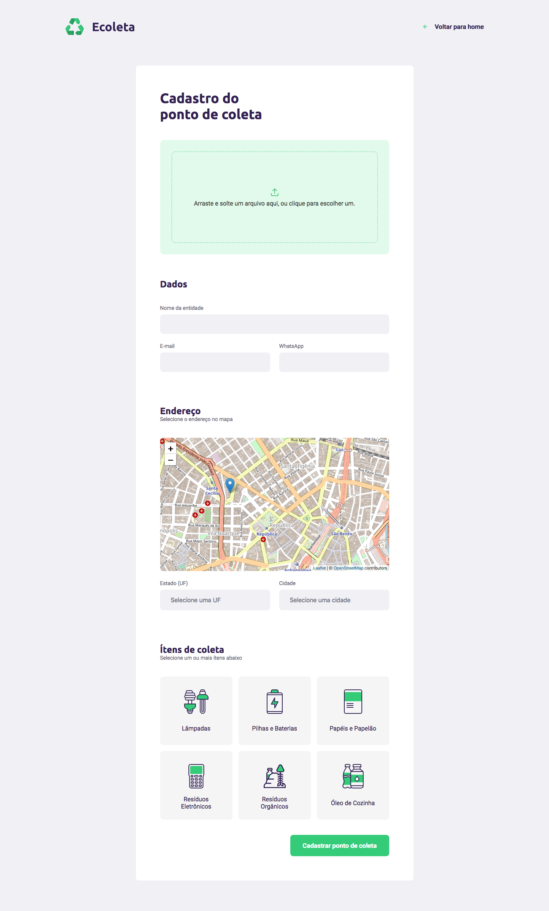

<p align="center">
    
</p>

# Frontend


_Tela inicial._



_Cadastro de pontos de coleta._

---

## Tecnologias utilizadas

Esta parte do projeto foi desenvolvida utilizando ReactJS.

---

## Para rodar a aplicação:

```shell
  $ yarn install
  $ yarn start
```

---

## Sobre o projeto

O **Ecoleta** é um projeto que visa ajudar doadores de produtos reciclável a encontrar pontos de coleta nas redondezas.
