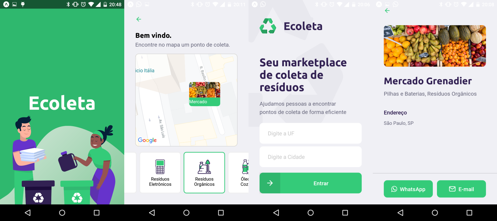

<p align="center">
    
</p>

# Mobile


_Telas do aplicativo_

---

## Tecnologias utilizadas

Esta parte do projeto foi desenvolvida utilizando React Native e Expo.

---

## Para rodar a aplicação:

```shell
  $ yarn install
  $ yarn start
```

---

## Sobre o projeto

O **Ecoleta** é um projeto que visa ajudar doadores de produtos reciclável a encontrar pontos de coleta nas redondezas.
