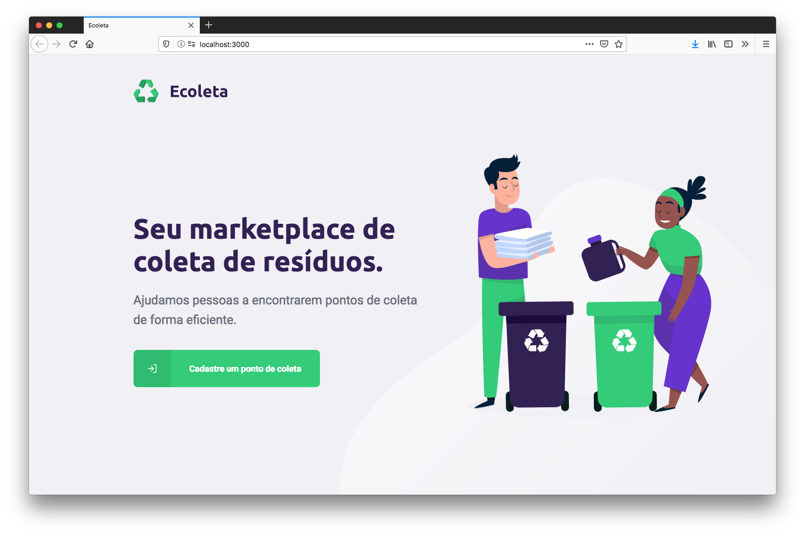

<h1 align="center">
    
</h1>

## Sobre o projeto

O **Ecoleta** é um projeto que visa ajudar doadores de produtos reciclável a encontrar pontos de coleta nas redondezas.

---

## Tecnologias utilizadas

Esse projeto foi desenvolvido utilizando as seguintes tecnologias abaixo:

- NodeJS + Express
- ReactJS
- React Native
- Expo
- TypeScript

---

## Como contribuir

- Crie um fork deste repositório
- Faça uma branch com a sua feature: `git checkout -b minha-feature`;
- Envie suas alterações: `git commit -m 'feat: Minha nova feature'`;
- Faça um push para a sua branch: `git push origin minha-feature`.
